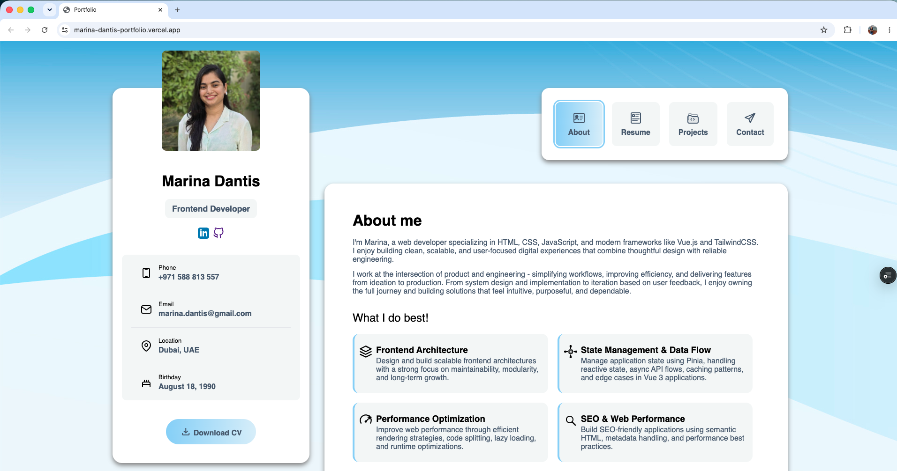
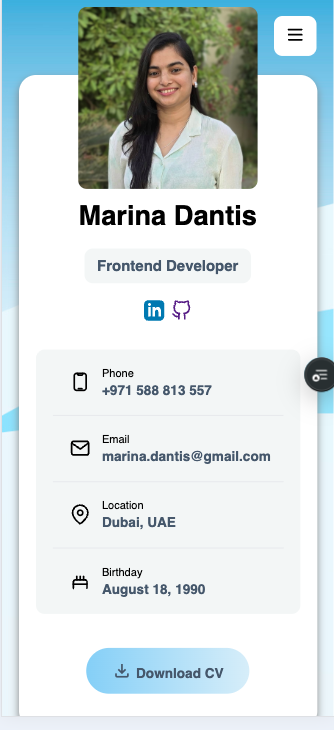

# Frontend Foundations

A collection of frontend projects built while learning and practicing HTML, CSS, responsive design, and modern web development concepts.

## 📚 Projects Included

### 1. Business Card
A simple digital business card project created using HTML and CSS.

Skills Practiced
- HTML structure
- CSS styling
- Layout fundamentals
- Typography

---

### 2. Marina Portfolio 🌟
A personal portfolio website showcasing my background, skills, projects, and contact information.

🔗 Live Demo: https://marina-dantis-portfolio.vercel.app/

#### Features
- Responsive design for desktop and mobile devices
- Clean and modern UI
- About Me section
- Skills showcase
- Projects section
- Contact information

#### Built With
- HTML5
- CSS3
- Responsive Web Design

#### Skills Practiced
- Semantic HTML
- Flexbox
- CSS Grid
- Responsive layouts
- UI design principles
- Deployment with Vercel

#### Screenshots

##### Desktop View

##### Mobile View

---

### 3. Profile Page
A responsive profile page built to practice layout techniques and component styling.

Skills Practiced
- HTML structure
- CSS styling
- CSS positioning
- Component structure

---

## 🚀 Getting Started

Clone the repository:

bash git clone https://github.com/your-github-username/frontend-foundations.git 

Navigate to any project folder:

bash cd frontend-foundations/marina-portfolio 

Open the index.html file in your browser.

---

## 🎯 Learning Goals

This repository serves as my frontend learning journey, where I practice:

- HTML5
- CSS3
- Responsive Web Design
- Accessibility Basics
- UI Development
- Git & GitHub Workflow
- Deployment

---

## 👩‍💻 Author

Marina Dantis

Frontend Developer | QA Engineer

Portfolio: https://marina-dantis-portfolio.vercel.app